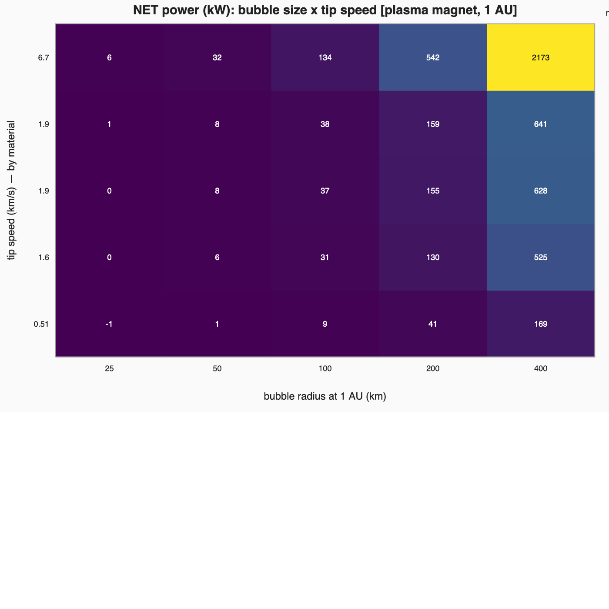
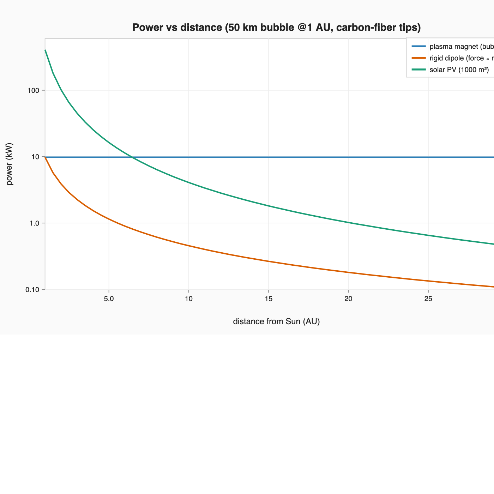
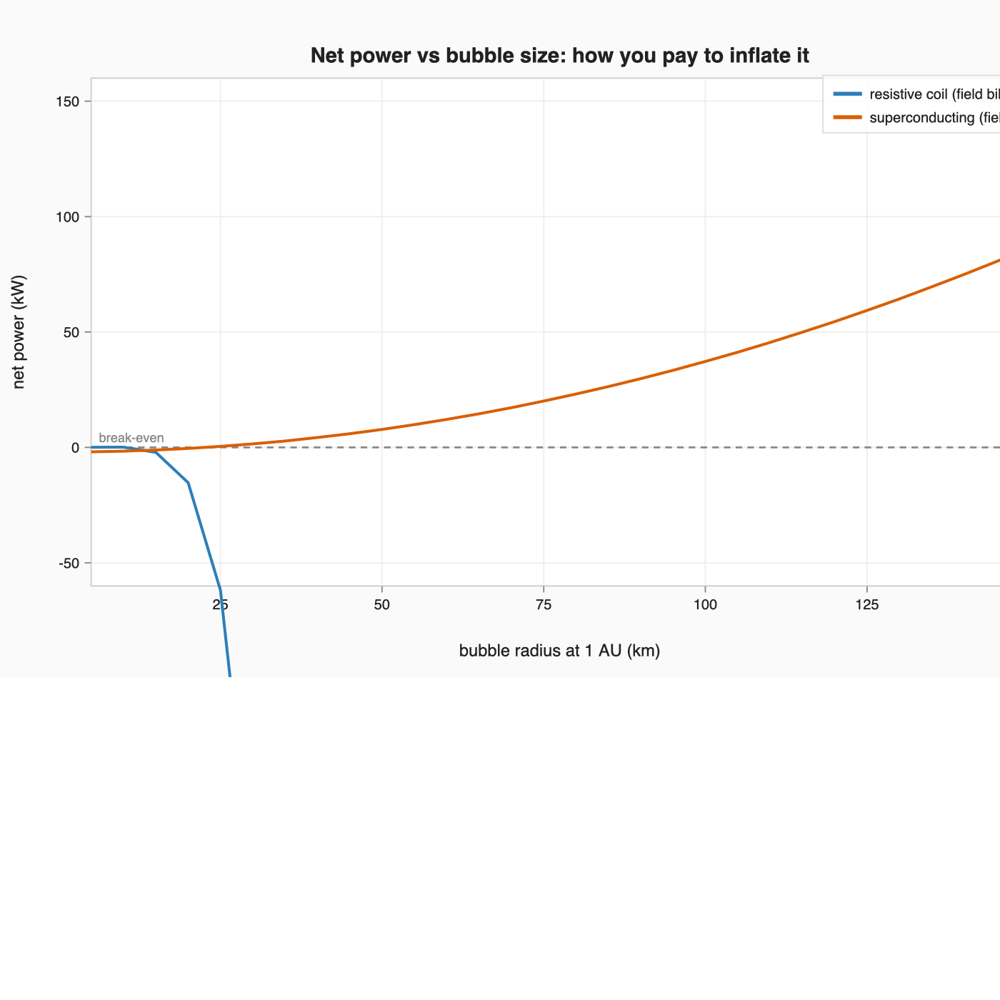
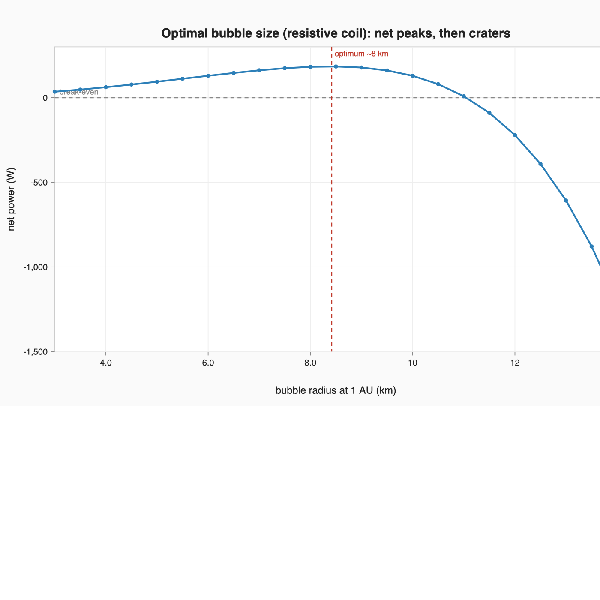
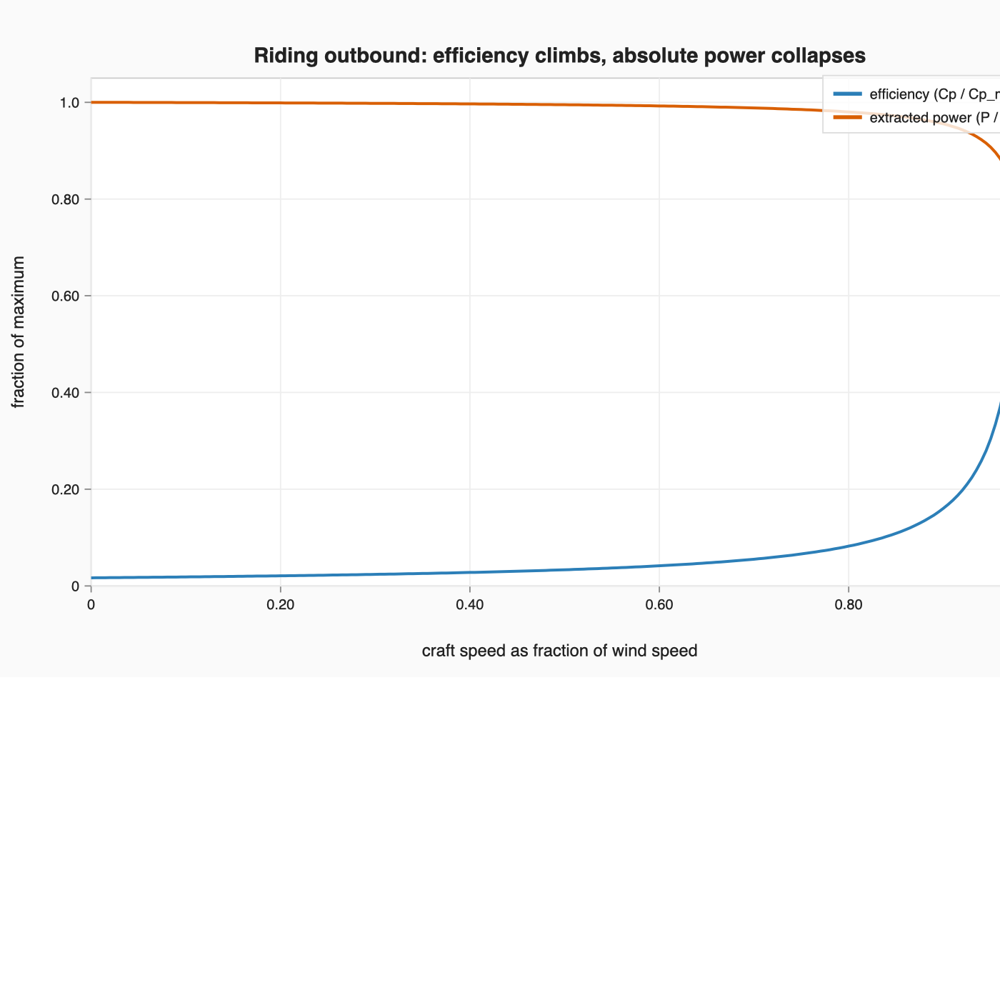
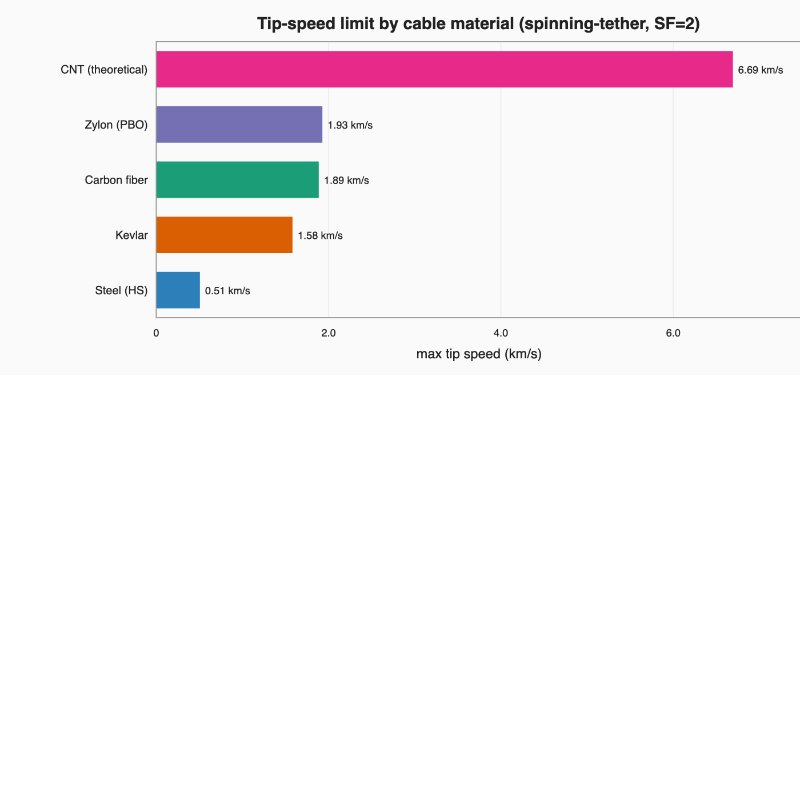

# Solar-Wind Turbine

*A mechanical windmill that rides — and harvests — the solar wind. Separate from
the [Orbital Lifeboats](../README.md) project, but in the same repo because it
could power a deep-system cache.*

Origin: Mick's idea, from an email he sent Robert Winglee right after the **M2P2**
press release (~2000) — magnetic sails on the ends of long counter-rotating
cables, toggled on/off so the rig **spins in place**, driving a generator from the
wind without being blown out of orbit.

> **This model was rebuilt** after the first pass mixed two incompatible
> assumptions (a *fixed* bubble for the size sweep, a *self-inflating* one for the
> "flat with distance" claim). The physics is now on one consistent chain and
> **pinned down by tests** — run `python3 test_turbine.py`.

- Model + tables: `python3 turbine.py`
- Tests (scaling laws, energy limits): `python3 test_turbine.py`
- Figures: `python3 figures.py` · Data page: `python3 build_page.py` → `index.html`

---

## TL;DR — what sets size, mass, and power

Three choices drive the whole design (and inform everything below):

- **Field-generator tech (the big one):** must be **superconducting** (or a
  wind-inflated plasma magnet) so holding the bubble is ~free; a resistive coil's
  field bill grows as R⁶ and loses outright.
- **Cable material:** sets the tip speed via √(2·specific-strength) — carbon fiber
  ~1.9 km/s, theoretical CNT ~6.7 km/s — and power scales with tip speed.
- **Cable length:** longer cables reach a target tip speed at a gentler spin
  (easier bottle toggling, lower per-tip load), paid for in cable mass.

A useful unit (superconducting coil + carbon-fiber cables) is **tens to a few
hundred kW**; a several-hundred-km bubble reaches the **MW** range. It's a **sail
first**, power as the bonus.

## The machine

Vertical-axis turbine in solar orbit: spin axis north–south, generator at the hub,
long counter-rotating cable-arms tipped with switchable magnetic-sail "bottles."
Fire the tips as a **force couple** (pure torque, ~zero net translation) so it
spins up and generates without leaving orbit; toggle through each rotation to keep
the couple driving the spin. Same rig also = a **sail**, an **ion-power source**,
and a **1-g habitat** at the radius where ω²r = g.

## The one consistent chain

```
knobs:   bubble radius at 1 AU (R1)  +  cable material (→ max tip speed)
         +  operating tip speed v_tip  +  sail model  +  bottle type
derived: at distance r → bubble radius R(r) and force F(r) (per sail model)
         → extracted power (drag turbine) → net = extracted − bottle power
```

- **Extracted power** = ½·F·v_tip·(1−v_tip/v_wind)² — a drag rotor on the sail force.
- **Tip speed** is capped by the **cable**: v_tip ≤ √(2·specific-strength) (the
  spinning-tether limit) — ~0.5 km/s steel, ~1.9 km/s carbon fiber, ~6.7 km/s CNT.
- **Force** = Cd·(ram pressure)·(bubble area), and the bubble area is a *derived*
  quantity that depends on distance and which sail model you pick.

## Power is a grid, not a number

This is the thing that caused the earlier confusion. Output isn't "5 kW" or "5 MW"
— it's a surface over **bubble size × tip speed**:



**Net power (kW) at 1 AU, plasma magnet, ~2 kW superconducting bottle:**

| tip speed (material) | 25 km | 50 km | 100 km | 200 km | 400 km |
|---|---|---|---|---|---|
| 0.5 km/s (steel) | −1 | +1 | +9 | +41 | +169 |
| 1.6 km/s (Kevlar) | +0 | +6 | +31 | +130 | +525 |
| 1.9 km/s (carbon fiber) | +1 | +8 | +37 | +155 | +628 |
| 6.7 km/s (CNT) | +6 | +32 | +134 | +542 | +2173 |

So it spans **sub-kW to multi-MW**. Both numbers I'd quoted were real — they were
just different cells of this table. Small bubble + weak cable = kW; big bubble +
strong cable = MW.

## With distance: it depends on the sail model (and the bubble is *not* fixed-size)



For a 50 km bubble **at 1 AU**, carbon-fiber tips:

| r (AU) | plasma magnet: R, F, P | rigid dipole: R, F, P |
|---|---|---|
| 1 | 50 km, 10.5 N, **9.9 kW** | 50 km, 10.5 N, 9.9 kW |
| 10 | **500 km**, 10.5 N, **9.9 kW** | 108 km, 0.49 N, 0.46 kW |
| 30 | **1500 km**, 10.5 N, **9.9 kW** | 155 km, 0.11 N, 0.10 kW |

- **Plasma magnet** (wind-inflated): the bubble *grows* (50→1500 km), force stays
  constant, power is flat. This is the real Wind-Rider property — but note the
  bubble is **not** 50 km out there; quoting "50 km everywhere" was the bug.
- **Rigid dipole** (fixed coil): R ∝ r^(1/3), force ∝ r^(−4/3), power **falls**.

Either way it never makes *more* power far out; the flat plasma-magnet case just
*holds* while solar PV craters as 1/r² — so it only wins where PV has died.

## Net, and can it power its own bottles?

Net = extracted − bottle. The make-or-break question (not free energy — the wind
pays; and ideal magnetic deflection does no work, so a perfect bottle costs ~0 to
maintain):

- **M2P2 (inject plasma; cost scales with bubble):** harvest ~0.7 µW/m² vs
  injection ~17 µW/m² → ~25× short, **net negative**. Can't self-power.
- **Plasma magnet (superconducting; ~fixed power):** harvest grows with bubble
  area while the bill stays flat → **net positive above a ~30 km bubble.** The
  self-inflation that makes the sail work is what lets it power its own field.

## Buying a bigger bubble with field power



You can inflate the bubble by dumping power into the coil — even close to the Sun
against the denser wind. But bubble radius grows only as the **6th root of power**
(R ∝ P^1/6), so a **resistive** coil's field bill explodes as R⁶ and net power
craters (64× the power for 2× the bubble). A big bubble only pays if the field is
held ~free — a **superconducting** coil (no ongoing power) or the wind-inflated
plasma magnet. Then bubble size is a coil-design / **mass** choice, not a power
drain, and you can build a big bubble at any distance — the denser inner-system
wind just wants a stronger (heavier) coil, not more watts.

## Is there an optimal bubble size?

For pure extraction, no — power grows with bubble area, so bigger is always more.
An optimum appears only when the *cost* of size grows faster than the harvest. A
**resistive** coil's field bill ∝ R⁶ gives a sharp peak at a small bubble (~8 km
at 1 AU, ~0.2 kW); the optimum radius is the **same at every distance** with
height ∝ 1/r² — which mainly shows resistive is a dead end. A **superconducting**
coil (fixed field cost) has **no interior optimum** — net grows as R² until cable
structure and coil mass cap it, so "best size" = the biggest bubble you can build.



## Riding outbound, and on a cycler



If it sails outbound, the *relative* wind drops toward the tip speed, so drag-
turbine efficiency climbs toward its λ=1/3 optimum — but absolute power falls as
v_rel³. **A power station wants max relative wind → stay put.** On an Earth–Mars
cycler the ~30 km/s orbital motion barely dents the 400 km/s wind (±1.4%), so
power is essentially the at-rest value across the leg. And extracting it **acts as
drag** — momentum theory requires a downwind (anti-sunward) reaction force; that
force is the magsail thrust, present whether or not you spin the rotor.

## Honest value (the reality check)

For a few kW this is wildly over-engineered — a few kg of solar panels beat it near
the Sun, a ~1-tonne Kilopower reactor beats it anywhere. Its real value is
propellantless **thrust** (it's a sail), with power as a bonus — or **MW-scale**
power in the deep outer system where panels are dead and reactors are heavy. The
power case only opens at MW, far out, not at kW anywhere.

## Tip-speed ceiling by material



## Files

| File | What |
|------|------|
| `turbine.py` | The model + printed tables (`python3 turbine.py`) |
| `test_turbine.py` | Physics tests — scaling laws, energy limits, drag curve |
| `figures.py` | SVG figures (reuses the sibling package's plotter) |
| `build_page.py` | Builds `index.html` (data straight from the model) |
| `figures/` | SVGs (+ `png/`) |
