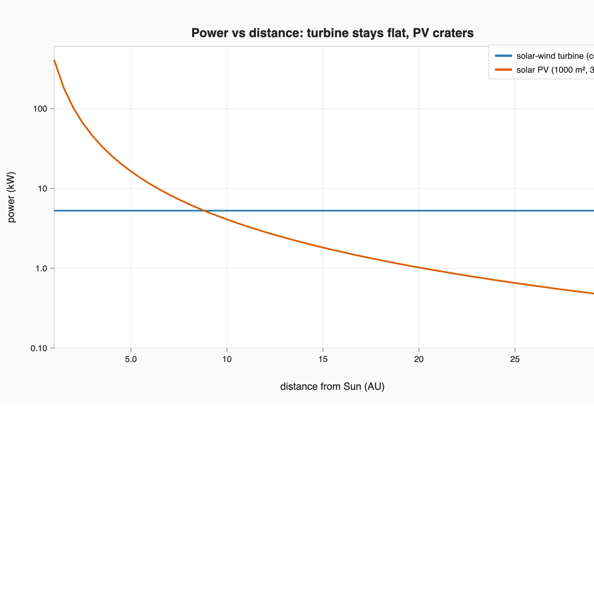
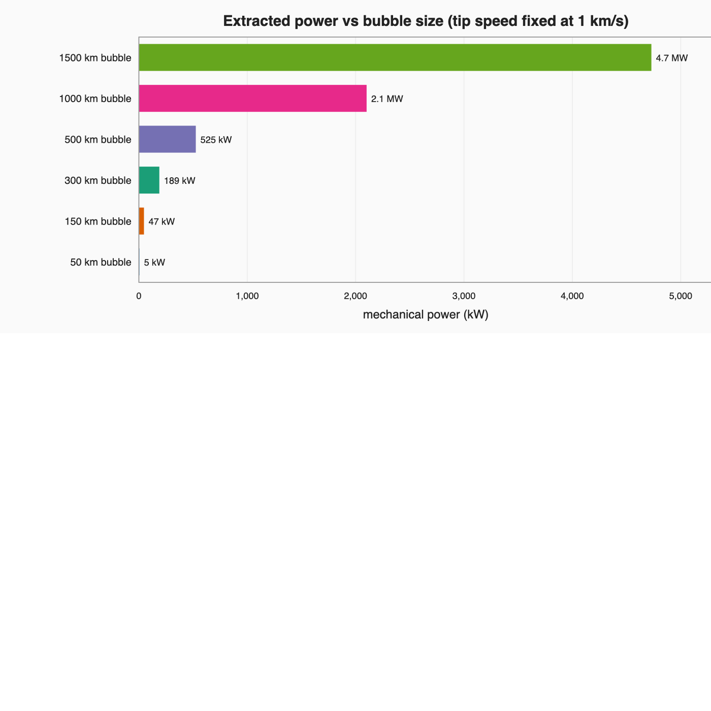

# Solar-Wind Turbine

*A mechanical windmill that rides — and harvests — the solar wind. Separate from
the [Orbital Lifeboats](../README.md) project, but kept in the same repo because
it could power a deep-system cache.*

This is a napkin-math model of an old idea (Mick's, dating to an email he sent
Robert Winglee right after the **M2P2** press release ~2000): take a magnetic
sail that the solar wind pushes on, put one on each end of long counter-rotating
cables, and toggle them on and off so the rig **spins in place** — generating
power from the wind without being blown out of its orbit.

Run it: `python3 turbine.py` · figures: `python3 figures.py`

---

## The machine

A **vertical-axis turbine** in solar orbit:

- Spin axis points north–south (perpendicular to the ecliptic); a **generator at
  the central hub**.
- Two (or more) long **counter-rotating cable-arms** lie in the orbital plane,
  each tipped with a switchable **magnetic-sail "bottle"** (M2P2 / plasma-magnet
  style) that the solar wind pushes on.
- Fire the tip-sails as a **force couple** — opposite arms pushed in opposite
  tangential directions. A couple is *pure torque with zero net translational
  force*, so the rig spins up and drives the generator **without** drifting out of
  orbit. Toggle the bottles on/off through each rotation to keep the couple
  driving the spin, switching to the inbound tips as the arms swing past.

The same structure is, at once, a **generator**, a **sail** (fire asymmetrically
for net thrust), an **ion-drive power source**, and a **1-g habitat** (at the
radius where ω²r = g).

## The physics, in five lines

1. **Extracted power = torque × ω = F_tip × v_tip** (it's a drag-type turbine).
2. **Tip speed is capped by the cable, not the wind.** A spinning tether fails
   when hoop stress ½·ρ·v_tip² exceeds its strength, so
   **v_tip_max = √(2 · specific-strength)** — the classic spinning-tether limit
   (~0.5 km/s steel, ~1.9 km/s carbon fiber, ~6.7 km/s theoretical CNT at SF 2).
3. **Force scales with bubble area**, and the bubble can be as big as you like —
   so you "buy" power with size: ~5 kW from a 50 km bubble, ~5 MW from a 1500 km
   one (at 1 km/s tips).
4. **The bubble self-scales** — it inflates as the wind thins — so in the
   plasma-magnet "constant-force" regime, **power is ~flat with distance from the
   Sun**, while solar panels fall as 1/r².
5. **Longer cables** reach a given tip speed at lower spin rate → easier sail
   toggling and lower per-tip load, paid for in cable mass.

## What the model says

The headline: the turbine's output is flat with distance, so it **overtakes a
1000 m² solar array around ~9 AU (near Saturn)** and by Neptune it isn't close.
That's the case for using it to power anything in the outer system.

Power is `capture × F × v_tip`, and `F` scales with bubble area — so megawatts are
a question of how big a magnetic bubble you're willing to inflate.

The cable is the ceiling. Tip speed (and therefore power, for a given force) is
bounded by the material's specific strength.

## Riding outbound: the efficiency/power trade

A subtlety (h/t the design's author): if the rig is *moving outbound*, the wind it
works against is the **relative** wind, `v_rel = v_wind·(1 − f)`. As the craft
speeds up toward wind speed, your fixed material-capped tip speed becomes a bigger
fraction of `v_rel` — the ratio `λ = v_tip/v_rel` climbs toward the drag-turbine
optimum of **1/3**, and efficiency `Cp` rises ~60× (0.0025 → 0.148).

The catch: available power falls as `v_rel³` and extracted power as ~`v_rel²`, so
the *absolute* output collapses even as efficiency peaks. Net rule:

- **A power station wants maximum relative wind → stay put** (orbit), where
  extracted power (~`v_rel²`) is greatest, and just accept low efficiency.
- The efficient-turbine regime is the **bonus mode of a wind-rider near terminal
  speed**: once it's coasting at ~wind speed (no thrust left), it can still
  scavenge the faint residual wind at near-optimal efficiency to power itself.

## Honest limits

- **You skim only a tiny fraction of the wind's energy flux.** Because the tips
  crawl (≤ ~km/s) next to a 400 km/s wind, a 50 km bubble intercepts ~2 MW of
  kinetic flux but the rig extracts only ~5 kW of it (~0.25%). The *available*
  power is enormous and flat with distance; the *mechanically extractable* power
  is `F × v_tip`. You raise it by growing the bubble (force) or the tip speed
  (material), not for free.
- **Toggle speed is the operational crux** — can a plasma bottle inflate/collapse
  faster than a quarter-rotation? Long cables help (they slow the rotation).
- **Spin-up momentum** is real: at steady state the **generator load** is the
  brake that holds the tip speed at its design value; the material limit is the
  hard ceiling above it.
- **Order-of-magnitude only.** Constant-force self-scaling is idealized; the real
  scaling is model-dependent, and the bottle/coil mass and power draw aren't yet
  in the budget.

## Files

| File | What |
|------|------|
| `turbine.py` | The model + a full printed analysis (`python3 turbine.py`) |
| `figures.py` | Generates the SVG figures (reuses the sibling package's SVG plotter) |
| `figures/` | SVG figures (+ `png/` renders) |
